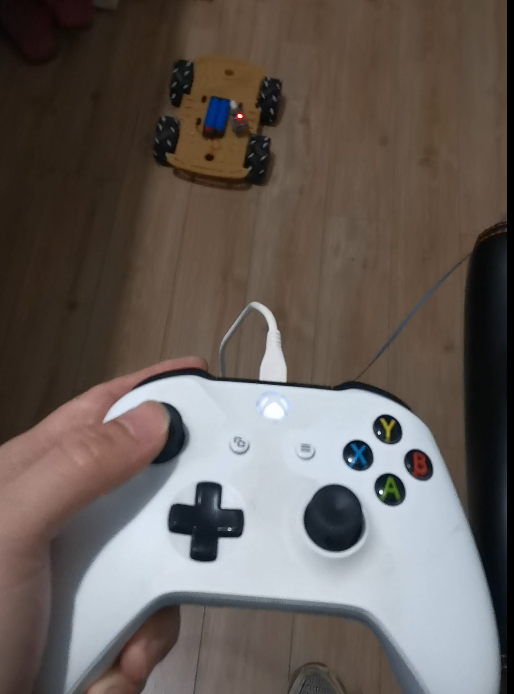
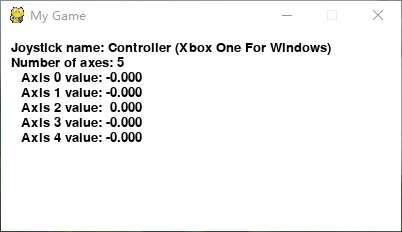
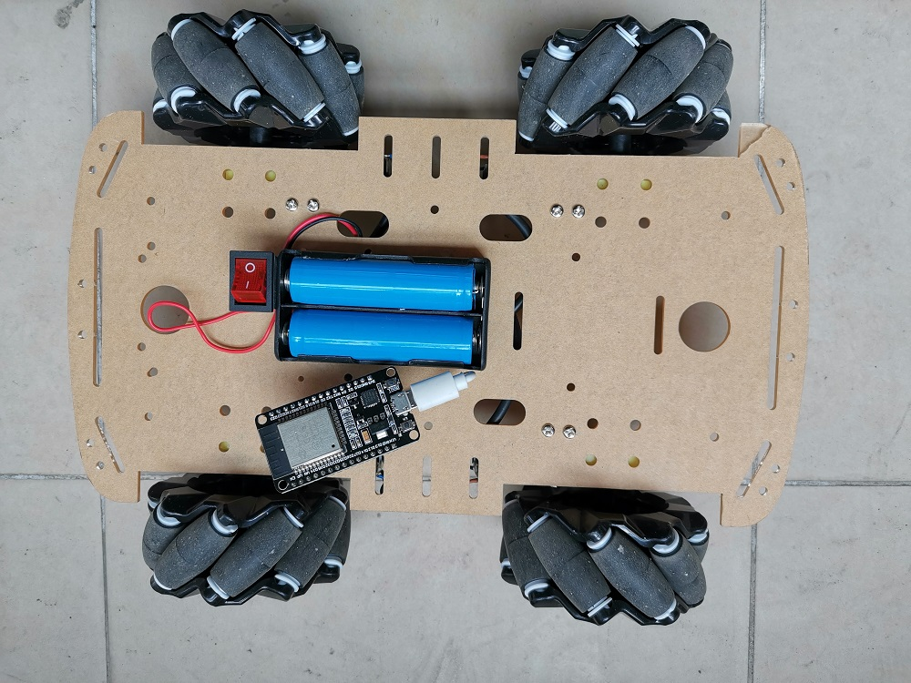
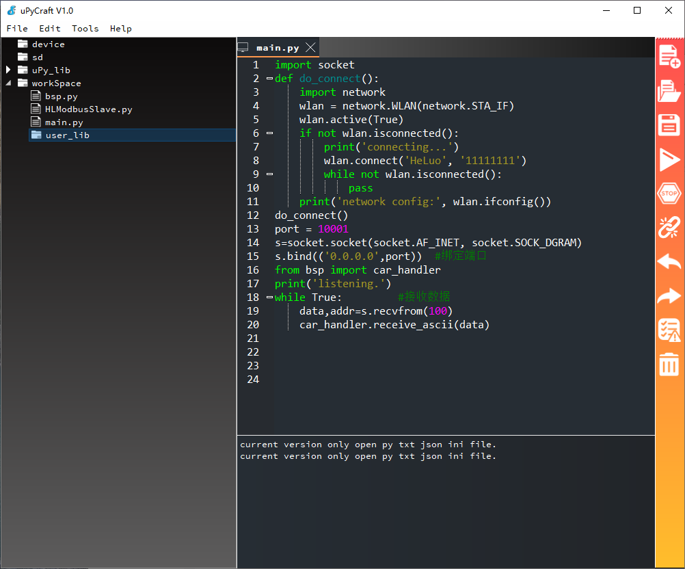

# esp32_Mecanum_wheels_joystick_wireless_car
> winxos 20200219

[toc]

### Brief Description

It's a self made wireless Mecanum wheels car controlled by joystick.

Just for fun.



You can found operate video here

 https://www.youtube.com/watch?v=rDZgJA3lPdM 

 https://www.youtube.com/watch?v=goBTG-G6iwU 

### Technical Details

#### System principle

1. Get the input of the joystick
2. According to the input signal, calculate the car motion parameters, generate the control commands.
3. Send the commands to the car.
4. The car received the commands, then analyze the commands, execute the commands to control motors.
5. repeat step 1.

#### Joystick code

File joystrick.py implement a simplest joystick controller in python, using pygame library.  It runs like



I used modbus-ascii as the communication protocol, if you are a newbie at modbus,  you may need to look  http://www.simplymodbus.ca/index.html  first.

The advantage of using a standard protocol  is that you can reuse this part of the code.

```python
def create_cmd(reg, x1):
    """
    Modbus Ascii protocol frame builder
    :param reg: Modbus Register address
    :param x1: value
    :return: Modbus Ascii frame
    """
    c = bytearray([1, 6, 0, reg, 0, 0])
    #  Modbus value have 2 bytes, i use the first byte as positive and the second byte as negative
    if x1 > 0:
        c[4] = x1
    else:
        c[5] = -x1
    x = sum(c) % 256
    #  x is LRC check
    if x == 0:
        c.append(0)
    else:
        c.append(256 - x)
    return f":{binascii.b2a_hex(c).decode()}\r\n"
```

function `create_cmd` can build modbus ascii frame to send.

yes , modbus ascii protocol is very simple and easy to use.

```python
vx = joystick.get_axis(0)
vy = joystick.get_axis(1)
vz = joystick.get_axis(4)
if abs(vx) > 0.2 or abs(vy) > 0.2 or abs(vz) > 0.2:
    if abs(vx) < 0.2:
        vx = 0
        if abs(vy) < 0.2:
            vy = 0
            # spd is your 4 motor's speed, the +- sign depends on your wheel install type and motor direct,
            # you may need to read some article about Mecanum wheel to handler it.
            spd = [vx + vy + vz, vx - vy - vz, vx + vy - vz, vx - vy + vz]
            print(f"{vx:.2f} {vy:.2f} {vz:.2f}")
            for j in range(4):
                t = int(spd[j] * 250)
                if t > 255:
                    t = 255
                    if t < -255:
                        t = -255
                        #  constrict the speed to range [-255,255]
                        s.sendto(create_cmd(j, t).encode(), ADDR)
```

This part of the code contains the kinematics calculation of Mecanum wheels and instruction sending.

You need to set your pc ip address at the first

```ADDR = ("192.168.0.106", 10001)  # your esp32 ip address```

That's joystick.py all.

#### Car Body

It's the cheapest Mecanum wheels car I can design.




BOM

| Name | Price\$ each | Price\$ total |
| ------- | ---------- | ---------- |
| wheel              | 3            |12|
| esp32              | 4            |4|
| 18650 batteries    | 1            |2|
| drivers and others | 3            |3|
| **total**          |              |21|

#### Car code

The car code in esp32_src directory.

I use micropython to develop,

so first you need to burn micropython firmware to your esp32, then you can use some software to develop such as uPyCraft.



##### main.py

When you upload the three files to the esp32, the main.py will start up automatically , 

you need to change the code in main.py

```python
wlan.connect('HeLuo', '11111111')
```

to you WIFI SSID and password.

##### bsp.py

this file determine the io port connection,

you need to change the code

```python
motors = [Motor(23,22),Motor(21,19),Motor(18,5),Motor(17,16)]
```

to the right sequence,  the same as your motors connection.

##### HLModbusSlave.py

this file is a simplest modbus slave module, very rough implementation.

### The End

Make a wireless controll Mecanum wheels car is a big challenge to a newbie,

You need to know thing about mechanics, mathematics, circuit, esp32, python, socket communication etc，

But when you finished this project, you will feel very satisfied and more motivated to challenge more difficult projects.

the project address is  https://github.com/winxos/esp32_mecanum_wheel_joystick_wireless_car 

Writing a good popular technical articles is not easy, I will post more interesting items in my free time, wish you like.

Click star,  Follow me,  is the greatest encouragement to the author.


